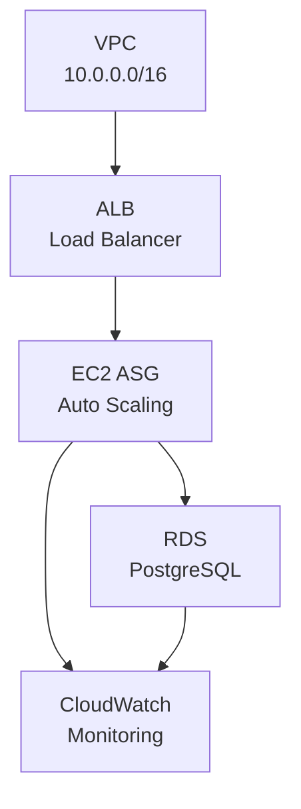

# Data Quality Framework

An enterprise-grade data quality validation framework with REST API, CLI tool, and Terraform infrastructure for lakehouse-style ETL pipelines. Validates datasets at different stages (raw and clean layers) to ensure data integrity.

**Status**: ✅ Production Ready | **Language**: English | **License**: MIT

---

## 🎯 Overview

Complete data quality solution featuring:

- **Schema Validation** - Enforce column names, data types, and constraints
- **Null Checks** - Validate mandatory field completeness
- **Uniqueness Constraints** - Enforce primary key constraints
- **Value Range Checks** - Ensure data within expected boundaries
- **Data Freshness Checks** - Validate timestamps and recency
- **Configurable Rules** - YAML-based configuration per dataset
- **REST API** - FastAPI with automatic Swagger documentation
- **CLI Tool** - Command-line interface for local operations
- **Database Persistence** - PostgreSQL with SQLAlchemy ORM
- **Docker Support** - Multi-stage builds with Docker Compose
- **Infrastructure as Code** - Complete Terraform for AWS deployment
- **Monitoring** - Prometheus metrics and CloudWatch integration

## 🏗️ Architecture

### System Architecture

```mermaid
graph TB
    subgraph "Data Pipeline"
        A["Data Source<br/>API/File/DB"]
        B["Raw Layer<br/>Bronze"]
        C["Quality Checks"]
        D["Clean Layer<br/>Silver"]
        E["Analytics<br/>Gold"]
    end
    
    subgraph "Validation Framework"
        F["Framework<br/>Core"]
        G["REST API<br/>FastAPI"]
        H["CLI Tool<br/>Click"]
        I["Database<br/>PostgreSQL"]
    end
    
    subgraph "Infrastructure"
        J["Monitoring<br/>Prometheus"]
        K["Dashboard<br/>Grafana"]
---

## 📡 API Endpoints

```bash
# Health Check
curl http://localhost:8000/health

# Validate JSON (file upload)
curl -X POST http://localhost:8000/validate/json \
  -F "file=@data/example_data.json" \
  -F "config=openweather_clean_validation.yaml" \
  -F "dataset=weather" \
  -F "layer=clean"

# Validate Dictionary
curl -X POST http://localhost:8000/validate/dict \
  -H "Content-Type: application/json" \
  -d '{"config": "config_name.yaml", "data": {"col1": "value"}}'

# List Configurations
curl http://localhost:8000/configs

# Prometheus Metrics
curl http://localhost:8000/metrics

# Interactive API Docs
open http://localhost:8000/docs
```

## 💻 CLI Commands

```bash
# Validate data
dqf validate --config config.yaml --data data.json --dataset my_dataset --layer raw

# View history
dqf history my_dataset

# List configurations
dqf list-configs

# Show configuration
dqf show-config config_name.yaml

# Initialize database
dqf init-db

# Show statistics
dqf stats
```

---

## 🐳 Docker Services

| Service | Port | Purpose |
|---------|------|---------|
| API | 8000 | FastAPI server |
| PostgreSQL | 5432 | Database |
| Prometheus | 9090 | Metrics |
| Grafana | 3000 | Dashboard |

## 🏗️ AWS Infrastructure

Complete Terraform deployment with:



Deploy to AWS:

```bash
cd terraform
terraform init
terraform plan -var-file="environments/prod.tfvars"
terraform apply -var-file="environments/prod.tfvars"
```

See [terraform/README.md](terraform/README.md) for details.

---

## 📦 Installation

### Docker Compose (Recommended)

```bash
docker-compose up
```

### Local Development

```bash
pip install -e ".[dev]"
pytest -v
```

### With All Features

```bash
pip install -e ".[complete]"
```

---

## 🧪 Testing

```bash
# Run tests
pytest -v

# With coverage
pytest --cov=data_quality_framework

# In Docker
docker-compose run dqf-dev pytest -v
```

---

## 📊 Project Statistics

| Component | Status | Lines |
|-----------|--------|-------|
| API (FastAPI) | ✅ | 600+ |
| CLI (Click) | ✅ | 450+ |
| Database (SQLAlchemy) | ✅ | 350+ |
| Terraform | ✅ | 1500+ |
| Docker | ✅ | 250+ |
| Tests | ✅ | 400+ |
| **TOTAL** | **✅** | **5550+** |

---

## 📚 Documentation

- **[CONTRIBUTING.md](CONTRIBUTING.md)** - Development guidelines
- **[terraform/README.md](terraform/README.md)** - Infrastructure guide
- **[docs/ARCHITECTURE.md](docs/ARCHITECTURE.md)** - Architecture details
- **[examples/](examples/)** - Code examples

---

## ✅ Features Implemented

### Framework Core
✅ Pandera schema validation  
✅ Null checks, uniqueness constraints, range validation  
✅ Data freshness checks  
✅ YAML configuration  
✅ Custom validators  

### REST API
✅ FastAPI with 8+ endpoints  
✅ Swagger/OpenAPI documentation  
✅ File upload support  
✅ Background task processing  
✅ Prometheus metrics  

### CLI Tool
✅ Click-based command-line interface  
✅ Database integration  
✅ History tracking  
✅ Color-coded output  

### Database
✅ PostgreSQL with SQLAlchemy ORM  
✅ Connection pooling  
✅ CRUD operations  
✅ 3 data models  

### DevOps
✅ Docker multi-stage build  
✅ Docker Compose (5 services)  
✅ Terraform for AWS (complete IaC)  
✅ 3 environments (dev/staging/prod)  
✅ Prometheus + Grafana monitoring  

### Monitoring
✅ CloudWatch integration  
✅ Custom alarms  
✅ Application & API logs  
✅ Metrics dashboard  

---

## 🚀 Next Steps

1. **Test Locally**
   ```bash
   docker-compose up
   curl http://localhost:8000/health
   ```

2. **Run Tests**
   ```bash
   docker-compose run dqf-dev pytest -v
   ```

3. **Try CLI**
   ```bash
   docker-compose run dqf-dev dqf --help
   ```

4. **Deploy to AWS** (when ready)
   ```bash
   cd terraform && terraform apply
   ```

---

**Status**: ✅ Production Ready  
**Version**: 1.0.0  
**Last Updated**: December 2024  

For support, see [CONTRIBUTING.md](CONTRIBUTING.md) or refer to documentation files.
   - Coverage reports with missing line details
   - Runs all validator examples
   - ETL integration testing
   - Detailed consolidated reports
   - Auto-comments on PRs

2. **Quick CI** - Fast feedback on code changes
   - Python 3.11 only
   - Quick test + coverage threshold check
   - Feedback in 2-5 minutes

3. **Analytics** - Scheduled detailed analytics
   - Runs every 6 hours on main branch
   - Coverage trends and metrics
   - HTML test and coverage reports

### Local Validation (Before Push)

Run the validation script locally to catch issues before pushing to GitHub:

```bash
./validate_locally.sh
```

This generates detailed logs and HTML coverage reports locally.

### Documentation

- **Quick Reference**: [GITHUB_ACTIONS_QUICK_REF.md](GITHUB_ACTIONS_QUICK_REF.md)
- **Setup Guide**: [GITHUB_ACTIONS_SETUP.md](GITHUB_ACTIONS_SETUP.md)
- **Full Documentation**: [docs/GITHUB_ACTIONS.md](docs/GITHUB_ACTIONS.md)

---

## 🐛 Troubleshooting

### Validation Error: "Column not found"
- Check that column names match exactly (case-sensitive)
- Verify data types (int vs float, string vs object)

### Freshness Check Failing
- Ensure timestamp column uses UTC or handle timezone awareness
- Check that your data's timestamps are actually recent

### Pandera Schema Errors
- Use Python data types: `int64`, `float64`, `object`, `datetime64[ns]`
- Verify column order doesn't matter in DataFrame
- Complex schemas can use dictionaries with constraints

### Tests Failing
- Ensure all dependencies are installed: `pip install -e ".[dev]"`
- Run with `-v` flag for verbose output
- Check Python version (3.9+)

## 🎓 Learning Resources

- [examples/openweather_examples.py](examples/openweather_examples.py) - All validation types
- [examples/lakehouse_integration_example.py](examples/lakehouse_integration_example.py) - ETL pipeline integration
- [config/openweather_raw_validation.yaml](config/openweather_raw_validation.yaml) - Raw layer config
- [config/openweather_clean_validation.yaml](config/openweather_clean_validation.yaml) - Clean layer config

## 📝 License

MIT License - See LICENSE file for details

## 👤 Author

Data Engineering Team

## 🔗 Related Projects

- [data-lakehouse-simulation](https://github.com/GRamos199/data-lakehouse-simulation) - Lakehouse ETL project using Apache Airflow
- [openweather-api](https://openweathermap.org/api) - OpenWeather API documentation

## 📞 Support

For issues, questions, or contributions:
1. Check existing issues
2. Review examples in `examples/` directory
3. Read configuration documentation
4. Create a new issue with detailed description

---

**Built with ❤️ for data quality and reliability**
