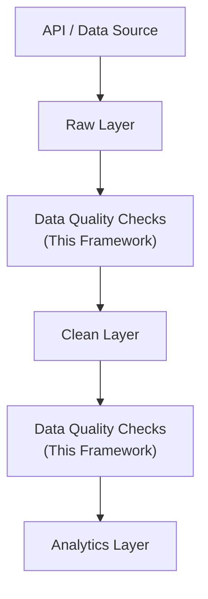
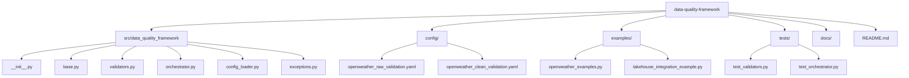
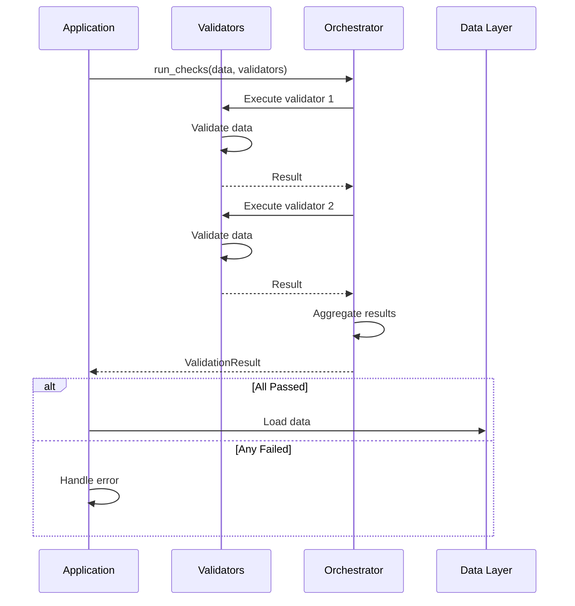

# Data Quality Framework

A reusable, modular data quality validation framework designed for lakehouse-style ETL pipelines. Validates datasets at different stages (raw and clean layers) to ensure data integrity and prevent invalid data from reaching analytics layers.

## 🎯 Overview

This framework provides:
- **Schema validation** - Enforce expected column names and data types
- **Null checks** - Validate mandatory field completeness
- **Uniqueness constraints** - Validate primary key constraints
- **Value range checks** - Ensure data within expected boundaries
- **Data freshness checks** - Validate timestamps for API-ingested data
- **Configurable rules** - YAML-based configuration per dataset
- **Failure blocking** - Prevent invalid data from propagating downstream
- **Clear reporting** - Detailed error messages and validation logs

## 🏗️ Architecture

This framework integrates with the lakehouse-simulation project:



### Components

- **Validators** - Individual validation rules
- **Orchestrator** - Manages running multiple validators
- **Config Loader** - Loads configuration from YAML files
- **Exceptions** - Custom error handling

## 📦 Installation

### From source

```bash
# Clone the repository
git clone https://github.com/yourusername/data-quality-framework.git
cd data-quality-framework

# Install in development mode
pip install -e .

# Install with dev dependencies
pip install -e ".[dev]"
```

### From PyPI (future)

```bash
pip install data-quality-framework
```

## 🚀 Quick Start

### 1. Basic Validation

```python
import pandas as pd
from data_quality_framework import NullCheckValidator, RangeValidator
from data_quality_framework.orchestrator import QualityCheckOrchestrator

# Create sample data
data = pd.DataFrame({
    "temperature": [15.2, 22.1, 12.8],
    "humidity": [45, 55, 70],
})

# Define validators
validators = [
    NullCheckValidator("mandatory_fields", ["temperature", "humidity"]),
    RangeValidator("valid_ranges", {
        "temperature": {"min": -60, "max": 65},
        "humidity": {"min": 0, "max": 100},
    }),
]

# Run checks
orchestrator = QualityCheckOrchestrator()
result = orchestrator.run_checks(
    data,
    validators,
    dataset_name="openweather",
    layer="raw",
    stop_on_failure=False,
)

if result.passed:
    print("✓ All validation checks passed!")
else:
    print("✗ Validation failed:")
    for validator_name, errors in result.errors.items():
        print(f"  {validator_name}: {errors}")
```

### 2. YAML Configuration

Create `config/openweather_raw_validation.yaml`:

```yaml
dataset: "openweather"
layer: "raw"

rules:
  - type: "null_check"
    name: "mandatory_fields"
    columns:
      - "city"
      - "temperature"
      - "humidity"
    enabled: true

  - type: "range"
    name: "valid_ranges"
    columns:
      temperature:
        min: -60
        max: 65
      humidity:
        min: 0
        max: 100
    enabled: true

  - type: "freshness"
    name: "data_freshness"
    timestamp_column: "dt"
    max_age_hours: 1
    enabled: true

on_failure: "log_and_stop"
```

Then load and use:

```python
from data_quality_framework import ConfigLoader

config = ConfigLoader.load_yaml("config/openweather_raw_validation.yaml")
print(config)  # Use configuration to build validators
```

## 📋 Validator Types

### SchemaValidator
Validates DataFrame schema using Pandera.

```python
from data_quality_framework import SchemaValidator

schema = {
    "id": "int64",
    "city": "string",
    "temperature": "float64",
    "dt": "datetime",
}

validator = SchemaValidator("schema_check", schema)
passed = validator.validate(data)
```

### NullCheckValidator
Ensures mandatory columns have no null values.

```python
validator = NullCheckValidator("nulls", ["city", "temperature", "humidity"])
```

### UniquenessValidator
Validates uniqueness constraints (single or composite keys).

```python
# Single column
validator = UniquenessValidator("unique_id", "id")

# Composite key
validator = UniquenessValidator("unique_city_date", ["city_id", "measurement_date"])
```

### RangeValidator
Validates that numeric values are within expected ranges.

```python
validator = RangeValidator("ranges", {
    "temperature": {"min": -60, "max": 65},
    "humidity": {"min": 0, "max": 100},
    "pressure": {"min": 870, "max": 1085},
})
```

### FreshnessValidator
Checks that data is not too old (critical for API-ingested data).

```python
validator = FreshnessValidator(
    "freshness",
    timestamp_column="dt",
    max_age_hours=1  # Data must be less than 1 hour old
)
```

### CompositeValidator
Combines multiple validators into one.

```python
composite = CompositeValidator("all_checks", [
    validator1,
    validator2,
    validator3,
])
```

## 🔌 Integration with Lakehouse Pipeline

### Example ETL Pipeline with Quality Gates

```python
from data_quality_framework import (
    NullCheckValidator,
    UniquenessValidator,
    RangeValidator,
    FreshnessValidator,
)
from data_quality_framework.orchestrator import QualityCheckOrchestrator
from data_quality_framework.exceptions import ValidationError

class LakehouseETL:
    def __init__(self):
        self.orchestrator = QualityCheckOrchestrator()
    
    def extract_and_load_raw(self, raw_data):
        """Load data to raw layer with validation"""
        validators = [
            FreshnessValidator("api_freshness", "dt", max_age_hours=1),
            NullCheckValidator("mandatory_fields", ["city", "temperature"]),
        ]
        
        try:
            result = self.orchestrator.run_checks(
                raw_data,
                validators,
                dataset_name="openweather",
                layer="raw",
                stop_on_failure=True,  # Block invalid data
            )
            print(f"✓ Raw layer: {len(raw_data)} records validated")
            return True
        except ValidationError as e:
            print(f"✗ Raw layer validation failed: {e}")
            return False
    
    def transform_and_load_clean(self, clean_data):
        """Load data to clean layer with validation"""
        validators = [
            NullCheckValidator("mandatory_fields", ["city_id", "measurement_date"]),
            UniquenessValidator("unique_keys", ["city_id", "measurement_date"]),
            RangeValidator("value_ranges", {
                "temperature_celsius": {"min": -60, "max": 65},
                "humidity_percentage": {"min": 0, "max": 100},
            }),
        ]
        
        try:
            result = self.orchestrator.run_checks(
                clean_data,
                validators,
                dataset_name="openweather",
                layer="clean",
                stop_on_failure=True,  # Prevent bad data reaching analytics
            )
            print(f"✓ Clean layer: {len(clean_data)} records validated")
            return True
        except ValidationError as e:
            print(f"✗ Clean layer validation failed: {e}")
            return False

# Usage
etl = LakehouseETL()

# Step 1: API extraction
raw_data = extract_from_openweather_api()

# Step 2: Load raw layer with quality gate
if not etl.extract_and_load_raw(raw_data):
    raise Exception("Cannot proceed: Raw data quality checks failed")

# Step 3: Transform
clean_data = transform_raw_to_clean(raw_data)

# Step 4: Load clean layer with quality gate
if not etl.transform_and_load_clean(clean_data):
    raise Exception("Cannot proceed: Clean data quality checks failed")

# Step 5: Load to analytics (data is guaranteed to be valid)
publish_to_analytics(clean_data)
```

## 📊 Real-World Scenarios

### Raw Layer: OpenWeather API Data

**Expected Validations:**
- ✓ Data must be less than 1 hour old (freshness)
- ✓ Required fields: `city`, `dt`, `temperature`, `humidity`
- ✓ Schema: correct column names and types
- ✓ Ranges: temperature [-60, 65], humidity [0, 100], etc.
- ✓ Dataset not empty

**Example Failure:**
```
✗ Validator 'API Freshness' failed: Oldest record is 25.5 hours old (max allowed: 1h)
→ Pipeline halted, data not loaded
```

### Clean Layer: Transformed Weather Data

**Expected Validations:**
- ✓ No nulls in: `city_id`, `city_name`, `measurement_date`, `temperature_celsius`
- ✓ Unique: `city_id` + `measurement_date` (one record per city per time)
- ✓ Ranges: temperature [-60, 65], humidity [0, 100]
- ✓ Freshness: measurements not older than 48 hours

**Example Failure:**
```
✗ Validator 'Unique City-Date' failed: Found 2 duplicate rows on columns ['city_id', 'measurement_date']
→ Pipeline halted, data not published to analytics
```

## 🧪 Running Examples

The framework includes practical examples showing all validation types:

```bash
# Run all examples
python examples/openweather_examples.py

# Output:
# ======================================================================
# EXAMPLE 1: Valid Raw OpenWeather Data
# ...
# ✓ All quality checks passed for openweather (raw)
# ======================================================================
# EXAMPLE 2: Raw Data with Missing Required Fields
# ...
# ✗ Quality checks failed for openweather (raw): ['Mandatory Fields']
```

### Example: Integration with ETL Pipeline

```bash
python examples/lakehouse_integration_example.py

# Output:
# ======================================================================
# LAKEHOUSE ETL PIPELINE WITH QUALITY GATES
# ======================================================================
# [EXTRACT] Fetching data from OpenWeather API...
# ✓ Extracted 3 records from API
# 
# [LOAD RAW] Validating data before loading to raw layer...
# ✓ Raw layer validation passed
# 
# [TRANSFORM] Cleaning and transforming raw data...
# ✓ Transformed 3 records
# 
# [LOAD CLEAN] Validating transformed data before loading...
# ✓ Clean layer validation passed
# 
# [PUBLISH] Loading to Analytics layer...
# ✓ Published 3 records to Analytics
# 
# ✓ PIPELINE COMPLETED SUCCESSFULLY
```

## 🧬 Configuration Files

Place validation configurations in `config/` directory:

- `openweather_raw_validation.yaml` - Raw layer OpenWeather checks
- `openweather_clean_validation.yaml` - Clean layer OpenWeather checks

Each configuration specifies:
- Dataset name
- Layer (raw, clean, etc.)
- List of validation rules with type, columns, and constraints
- Failure behavior (log_only, log_and_stop, quarantine)

## 🛠️ API Reference

### QualityCheckOrchestrator

```python
orchestrator = QualityCheckOrchestrator()

# Run validators
result = orchestrator.run_checks(
    data: pd.DataFrame,
    validators: List[BaseValidator],
    dataset_name: str,
    layer: str,
    stop_on_failure: bool = True,
) -> ValidationResult

# Get history
history = orchestrator.get_validation_history()

# Generate report
report = orchestrator.generate_report()
```

### ValidationResult

```python
result.dataset_name      # Name of the dataset
result.layer             # Layer name (raw, clean, etc.)
result.passed            # Boolean: validation passed?
result.validators_run    # List of validators executed
result.failed_validators # List of validators that failed
result.errors            # Dict mapping validator name to error list
result.timestamp         # When validation ran

result.to_dict()         # Convert to dictionary
```

### ValidationError

```python
try:
    orchestrator.run_checks(...)
except ValidationError as e:
    print(e.message)
    print(e.validation_errors)  # Dict with detailed errors
```

## 📈 Testing

Run the test suite:

```bash
# Run all tests
pytest tests/ -v

# Run specific test file
pytest tests/test_validators.py -v

# With coverage
pytest tests/ --cov=src/data_quality_framework --cov-report=html
```

## 📚 Project Structure



## 🔄 Workflow



## ⚙️ Configuration Best Practices

1. **Separate configs per layer** - `*_raw_validation.yaml`, `*_clean_validation.yaml`
2. **Reuse across datasets** - One framework for all your data sources
3. **Version control configs** - Track changes to validation rules
4. **Document custom rules** - Add descriptions to YAML rules
5. **Log results** - Always capture validation outcomes for auditing

## 🤝 Integration with Airflow

This framework is designed to work with Apache Airflow DAGs:

```python
from airflow import DAG
from airflow.operators.python import PythonOperator
from data_quality_framework.orchestrator import QualityCheckOrchestrator

def validate_raw_data(ti):
    raw_data = ti.xcom_pull(task_ids='extract_api')
    
    orchestrator = QualityCheckOrchestrator()
    result = orchestrator.run_checks(
        raw_data,
        validators=[...],
        dataset_name='openweather',
        layer='raw',
        stop_on_failure=True,
    )
    
    return result.to_dict()

# In your DAG:
validate_task = PythonOperator(
    task_id='quality_check_raw',
    python_callable=validate_raw_data,
    dag=dag,
)
```

## 🐛 Troubleshooting

### Validation Error: "Column not found"
- Check that column names match exactly (case-sensitive)
- Verify data types (int vs float, string vs object)

### Freshness Check Failing
- Ensure timestamp column uses UTC or handle timezone awareness
- Check that your data's timestamps are actually recent

### Pandera Schema Errors
- Use Python data types: `int64`, `float64`, `object`, `datetime64[ns]`
- Verify column order doesn't matter in DataFrame
- Complex schemas can use dictionaries with constraints

### Tests Failing
- Ensure all dependencies are installed: `pip install -e ".[dev]"`
- Run with `-v` flag for verbose output
- Check Python version (3.9+)

## 🎓 Learning Resources

- [examples/openweather_examples.py](examples/openweather_examples.py) - All validation types
- [examples/lakehouse_integration_example.py](examples/lakehouse_integration_example.py) - ETL pipeline integration
- [config/openweather_raw_validation.yaml](config/openweather_raw_validation.yaml) - Raw layer config
- [config/openweather_clean_validation.yaml](config/openweather_clean_validation.yaml) - Clean layer config

## 📝 License

MIT License - See LICENSE file for details

## 👤 Author

Data Engineering Team

## 🔗 Related Projects

- [data-lakehouse-simulation](https://github.com/yourusername/data-lakehouse-simulation) - Lakehouse ETL project using Apache Airflow
- [openweather-api](https://openweathermap.org/api) - OpenWeather API documentation

## 📞 Support

For issues, questions, or contributions:
1. Check existing issues
2. Review examples in `examples/` directory
3. Read configuration documentation
4. Create a new issue with detailed description

---

**Built with ❤️ for data quality and reliability**
