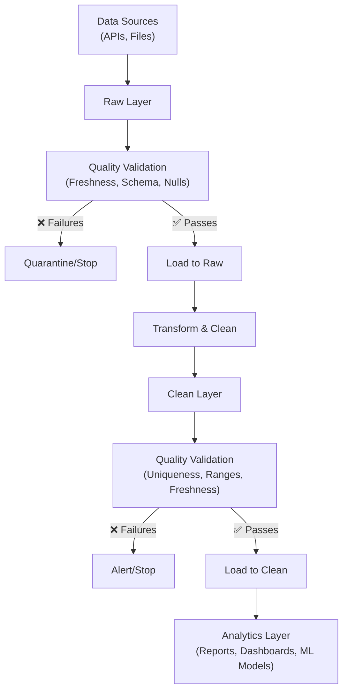
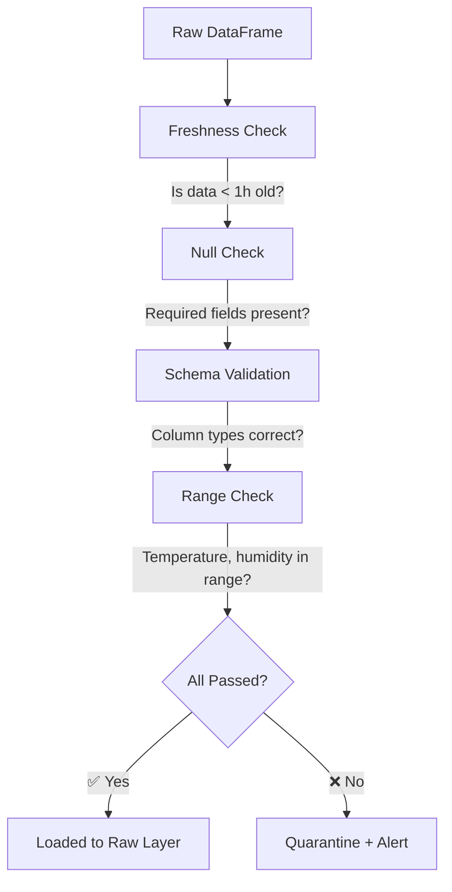
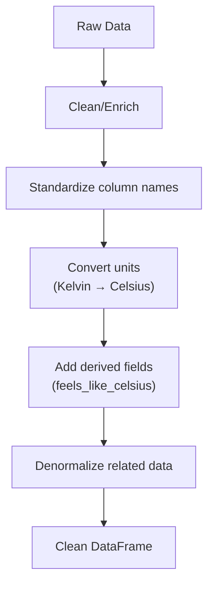
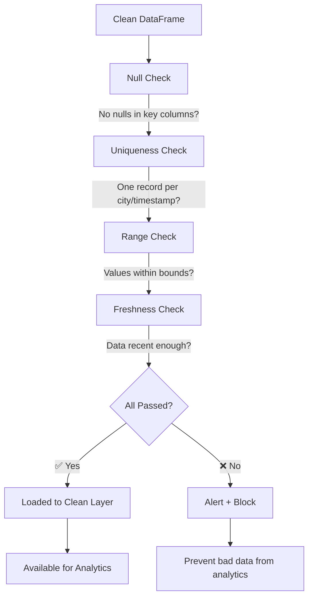
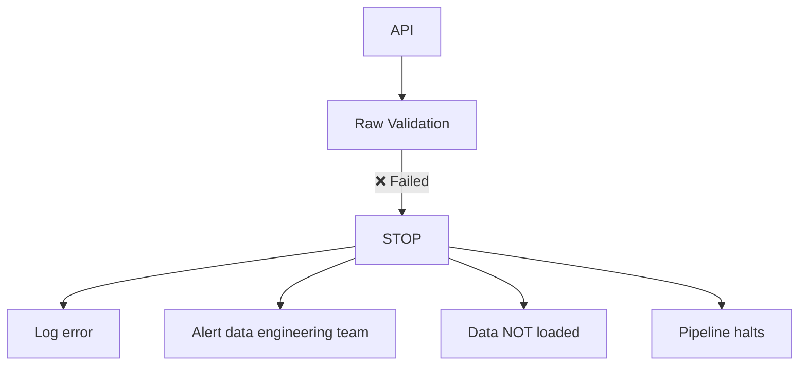
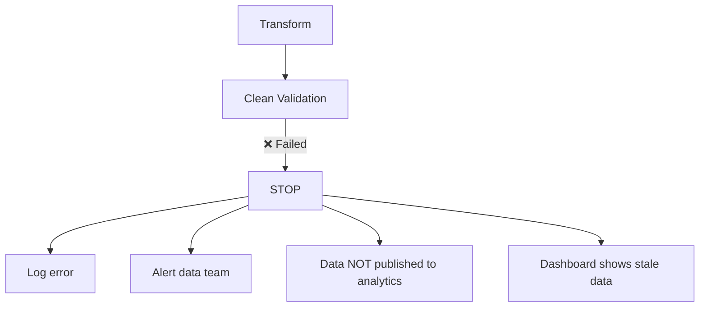

# Architecture and Design

## System Architecture

The Data Quality Framework follows a layered, modular architecture designed for reusability and flexibility.



## Component Overview

### 1. Validators (`validators.py`)

Individual validation rule implementations:

| Validator | Purpose | Example |
|-----------|---------|---------|
| `SchemaValidator` | Validate column names and data types | Check DataFrame has expected schema |
| `NullCheckValidator` | Ensure mandatory fields have values | City, temperature, timestamp required |
| `UniquenessValidator` | Validate primary key constraints | One weather record per city per hour |
| `RangeValidator` | Check values within boundaries | Temperature between -60 and 65°C |
| `FreshnessValidator` | Validate data recency (API data) | API data not older than 1 hour |
| `CustomValidator` | Custom logic via callable function | Complex business logic |
| `CompositeValidator` | Run multiple validators | Combine all checks for a layer |

### 2. Orchestrator (`orchestrator.py`)

Manages validation execution:
- Runs multiple validators in sequence
- Handles validation failures (stop or continue)
- Logs validation results
- Tracks validation history
- Generates summary reports

```python
orchestrator = QualityCheckOrchestrator(logger=custom_logger)

result = orchestrator.run_checks(
    data=raw_data,
    validators=[validator1, validator2],
    dataset_name="openweather",
    layer="raw",
    stop_on_failure=True,  # Block invalid data
)
```

### 3. Configuration Loader (`config_loader.py`)

Loads validation rules from configuration files:
- YAML and JSON support
- Validates configuration structure
- Merges configurations
- Extensible for custom formats

```yaml
dataset: "openweather"
layer: "raw"

rules:
  - type: "freshness"
    timestamp_column: "dt"
    max_age_hours: 1
  
  - type: "null_check"
    columns: ["city", "temperature"]
```

### 4. Base Classes (`base.py`)

Abstract interfaces for extension:

```python
class BaseValidator(ABC):
    """All validators inherit from this"""
    
    @abstractmethod
    def validate(self, data: pd.DataFrame) -> bool:
        pass

class ValidationResult:
    """Encapsulates validation outcome"""
    passed: bool
    validators_run: List[str]
    failed_validators: List[str]
    errors: Dict[str, List[str]]
```

### 5. Exception Handling (`exceptions.py`)

Custom exceptions for clear error messages:

```python
class ValidationError(Exception):
    """Raised when validation fails"""
    validation_errors: Dict[str, List[str]]

class ConfigError(Exception):
    """Raised when configuration is invalid"""
```

## Data Flow Example: OpenWeather API

### Step 1: Extract from API
```
API Request → JSON Response
```

### Step 2: Load to Raw Layer


### Step 3: Transform


### Step 4: Load to Clean Layer


## Configuration Structure

### Raw Layer Configuration

```yaml
dataset: "openweather"
layer: "raw"
description: "OpenWeather API raw data validation"

rules:
  # 1. Freshness: API data must be recent
  - type: "freshness"
    name: "data_freshness"
    timestamp_column: "dt"
    max_age_hours: 1
    enabled: true

  # 2. Null Check: Required fields present
  - type: "null_check"
    name: "mandatory_fields"
    columns: ["city", "dt", "temperature", "humidity"]
    enabled: true

  # 3. Schema: Column names and types
  - type: "schema"
    name: "schema_validation"
    schema:
      id:
        type: "int64"
      city:
        type: "string"
      temperature:
        type: "float64"
    enabled: true

  # 4. Range: Realistic value ranges
  - type: "range"
    name: "valid_ranges"
    columns:
      temperature:
        min: -60
        max: 65
      humidity:
        min: 0
        max: 100
    enabled: true

on_failure: "log_and_stop"
```

### Clean Layer Configuration

```yaml
dataset: "openweather"
layer: "clean"
description: "Cleaned and transformed weather data"

rules:
  # 1. Null Check: Clean data should be complete
  - type: "null_check"
    name: "clean_mandatory_fields"
    columns: ["city_id", "city_name", "measurement_date"]
    enabled: true

  # 2. Uniqueness: One record per city per measurement
  - type: "uniqueness"
    name: "unique_city_date"
    key_columns: ["city_id", "measurement_date"]
    enabled: true

  # 3. Range: Transformed values still valid
  - type: "range"
    name: "clean_value_ranges"
    columns:
      temperature_celsius:
        min: -60
        max: 65
    enabled: true

on_failure: "log_and_stop"
```

## Failure Modes and Responses

### Raw Layer Failure



**Action:** Data engineer investigates API issue
- API unavailable?
- Response format changed?
- Network timeout?

### Clean Layer Failure



**Action:** Data engineer investigates transformation
- Logic error in transformation?
- New data pattern not handled?
- Schema mismatch?

## Integration Points

### 1. Apache Airflow

```python
@task
def validate_raw(raw_data):
    validators = [FreshnessValidator(...), NullCheckValidator(...)]
    result = orchestrator.run_checks(raw_data, validators, ...)
    if not result.passed:
        raise AirflowException(f"Quality check failed: {result.errors}")
    return raw_data
```

### 2. Apache Spark

```python
from pyspark.sql import DataFrame

def validate_spark_df(df: DataFrame):
    # Convert to pandas for validation
    pandas_df = df.toPandas()
    validators = [...]
    result = orchestrator.run_checks(pandas_df, validators, ...)
    return result.passed
```

### 3. dbt (data build tool)

```sql
-- In dbt model
SELECT *
FROM raw.openweather
WHERE TRUE
  AND city IS NOT NULL
  AND temperature BETWEEN -60 AND 65
  AND humidity BETWEEN 0 AND 100
  AND dt > CURRENT_TIMESTAMP - INTERVAL '1 hour'
```

Then validate the entire dbt DAG with this framework.

## Design Principles

### 1. **Separation of Concerns**
- Each validator handles one type of check
- Orchestrator manages execution flow
- Config loader handles specifications
- Exceptions handle error cases

### 2. **Configurability**
- Validation rules defined in YAML, not code
- Same framework for different datasets
- Easy to update rules without code changes

### 3. **Reusability**
- Validators can be combined in any order
- CompositeValidator groups related checks
- Single orchestrator for all validations

### 4. **Failure Prevention**
- Validators run BEFORE data is loaded
- Bad data is stopped, never reaches analytics
- Clear error messages for debugging

### 5. **Observability**
- All validations logged
- Results tracked in history
- Reports generated for analysis

## Performance Considerations

### Optimization Tips

1. **Validator Order**: Run cheap checks first
   ```python
   validators = [
       NullCheckValidator(...),           # Fast: checks for nulls
       RangeValidator(...),              # Fast: simple comparisons
       FreshnessValidator(...),          # Medium: time comparison
       SchemaValidator(...),             # Slow: schema inspection
   ]
   ```

2. **Sample-Based Validation**: For huge datasets
   ```python
   sample = data.sample(frac=0.1)  # Validate 10% for speed
   result = orchestrator.run_checks(sample, validators, ...)
   ```

3. **Selective Validation**: Disable expensive checks if not needed
   ```yaml
   - type: "schema"
     enabled: false  # Skip if we know schema is stable
   ```

## Extension Points

### Custom Validator

```python
from data_quality_framework.base import BaseValidator

class MyCustomValidator(BaseValidator):
    def __init__(self, name, custom_param):
        super().__init__(name)
        self.custom_param = custom_param
    
    def validate(self, data):
        # Your logic here
        return True/False
```

### Custom Config Loader

```python
from data_quality_framework import ConfigLoader

class DatabaseConfigLoader(ConfigLoader):
    @staticmethod
    def load_from_database(connection_string, config_id):
        # Load from database instead of YAML
        pass
```

## Future Enhancements

- [ ] Distributed validation for Spark/Pandas
- [ ] ML-based anomaly detection
- [ ] Data quality scoring (0-100)
- [ ] Integration with Great Expectations library
- [ ] Web UI for validation rule management
- [ ] Metrics export to monitoring systems (Prometheus, etc.)
- [ ] Historical comparison validators
- [ ] Automated remediation rules

---

For more details, see the [README.md](../README.md)
